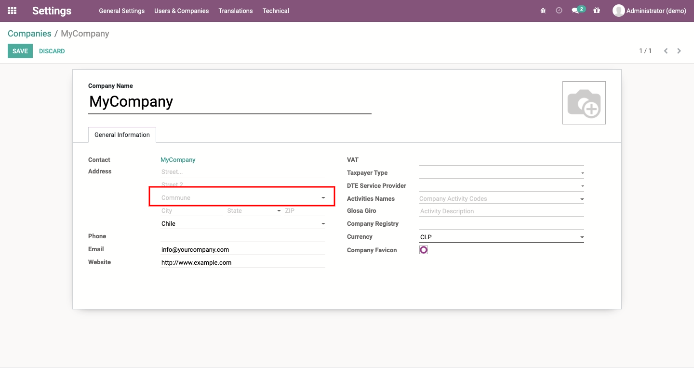
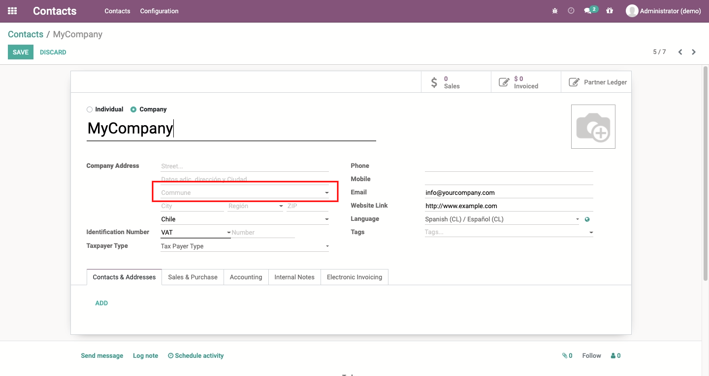

# Chilean states and cities
Adds states and cities not included by default. This module was improved by
Konos based on the one originally developed by Blanco Martín & Asociados.

## Table of contents
* [Configuration](#configuration)
* [Usage](#usage)
* [Credits](#credits)
  * [Authors](#authors)
  * [Contributors](#contributors)
  * [Maintainers](#maintainers)

## Configuration
There's no need for any special configuration to enable this feature.

## Usage
From now on, users can choose the city from a specific list instead of a free
text field for companies and contacts.

## Credits

### Authors
* Konos Soluciones & Servicios

### Contributors
* Alexander Olivares <<aolivares@konos.cl>>

### Maintainers
This module is maintained by **Konos Soluciones & Servicios**.

Current maintainer:
* Alexander Olivares <<aolivares@konos.cl>>
