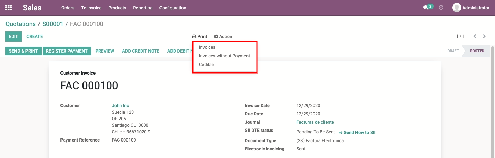
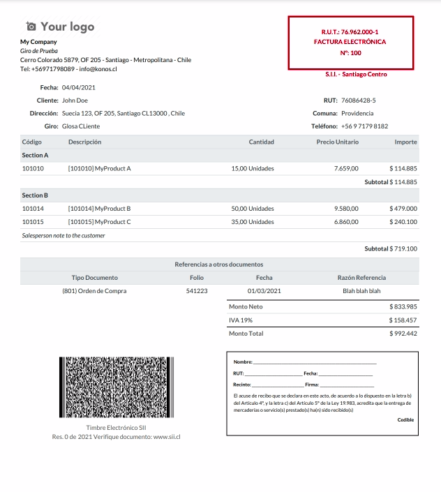

# Custom Invoice Layout
An alternative layout to the one already provided by Odoo.

This layout was developed following the [SII guidelines](https://www.sii.cl/factura_electronica/manual_muestras_impresas.pdf) about the correct
preparation of samples of electronic documents.

## Table of contents
* [Configuration](#configuration)
* [Usage](#usage)
* [Credits](#credits)
  * [Authors](#authors)
  * [Contributors](#contributors)
  * [Maintainers](#maintainers)

## Configuration
There's no need for any special configuration to enable this feature.

## Usage
Go to *Accounting > Customers > Invoices* select the desired invoice and print
a regular invoice or cedible.

## Credits

### Authors
* Konos Soluciones & Servicios

### Contributors
* Alexander Olivares <<aolivares@konos.cl>>

### Maintainers
This module is maintained by **Konos Soluciones & Servicios**.

Current maintainer:
* Alexander Olivares <<aolivares@konos.cl>>
