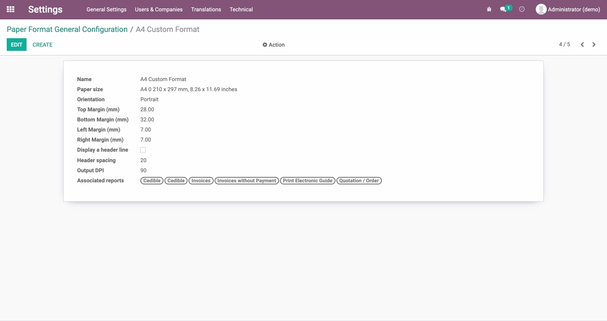
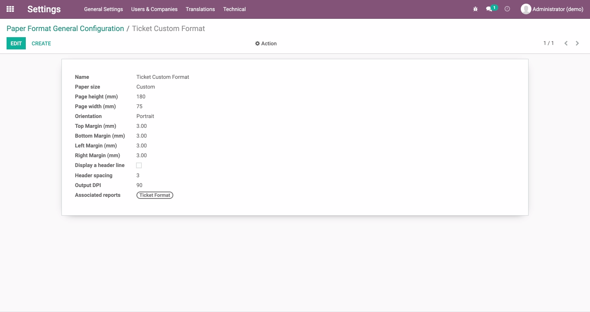

# Custom Paper Format
Paper format to be used by default on Chilean layouts.

## Table of contents
* [Configuration](#configuration)
* [Usage](#usage)
* [Credits](#credits)
  * [Authors](#authors)
  * [Contributors](#contributors)
  * [Maintainers](#maintainers)

## Configuration
There's no need for any special configuration to enable this feature.

## Usage
This module enables paper format to be used on the following documents:

* Sales Order
* Delivery Guide
* Invoice
* Ticket

## Credits

### Authors
* Konos Soluciones & Servicios

### Contributors
* Alexander Olivares <<aolivares@konos.cl>>

### Maintainers
This module is maintained by **Konos Soluciones & Servicios**.

Current maintainer:
* Alexander Olivares <<aolivares@konos.cl>>
